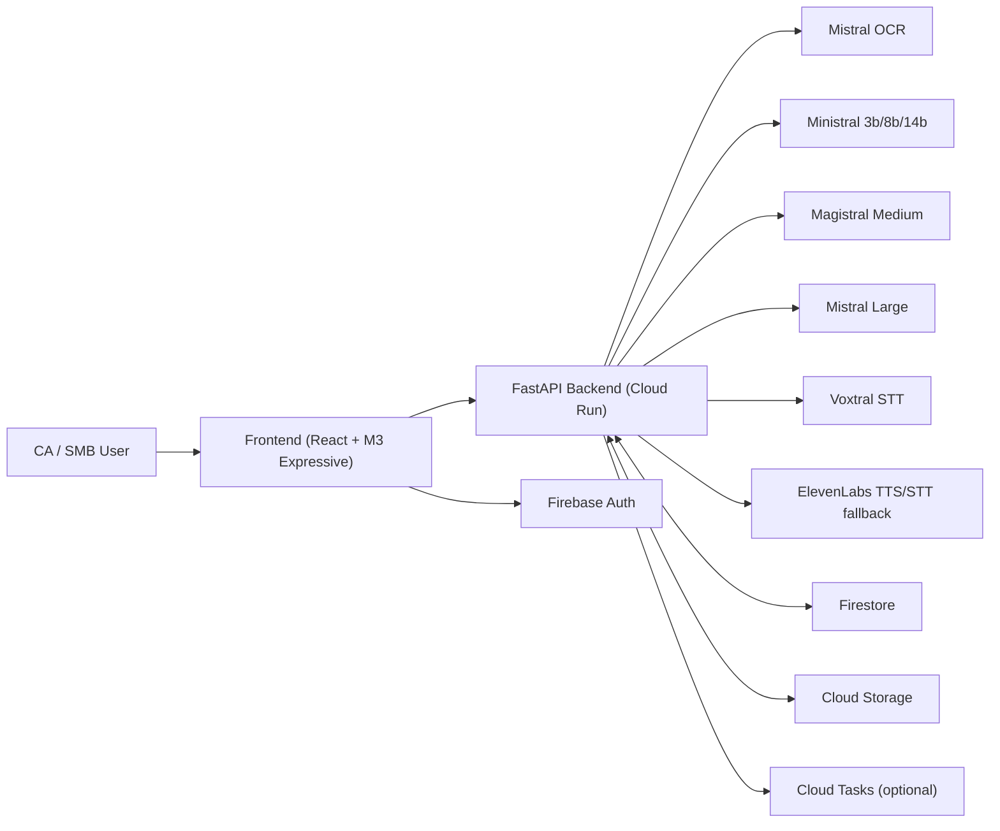

# GST Intelligence Magic

Action-first GST reconciliation and risk intelligence workspace for Indian SMBs and CA teams.

This project was built as a **Mistral Worldwide Hackathon** solution to reduce GST filing risk, cut manual reconciliation effort, and improve audit readiness with AI-assisted workflows.

---

## What This Solves

Indian businesses and accountants repeatedly face three expensive GST pain points:

1. **ITC mismatch risk**  
   Purchase register invoices do not match supplier-filed GSTR-1/GSTR-2B entries, leading to blocked or reversed ITC.

2. **HSN/SAC coding errors**  
   Wrong HSN selection creates compliance exposure, penalties, and rework.

3. **Manual reconciliation overhead**  
   CA teams spend hours every cycle matching invoices, identifying exceptions, and preparing follow-ups.

---

## Why This Is Valuable for India

`GST Intelligence Magic` is designed for India-specific compliance workflows:

1. Supports **GST-style invoice/GSTR-2B reconciliation** with risk grading.
2. Uses **Indian numbering context** (ITC at risk in rupees).
3. Enables multilingual operations: **English, Hindi, Tamil, Hinglish, Tanglish** across text/voice paths.
4. Provides **CA triage workflows**: severity ranking, role-based inbox, evidence pack generation, and narration.
5. Works with **real-world upload formats**: JSONL/CSV, JPG/PNG, PDF.

---

## Core Capabilities

### 1) Reconciliation Pipeline

1. Upload invoice + GSTR-2B files.
2. Parse/OCR/extract structured invoice fields.
3. Reconcile against GSTR-2B and apply GST rule checks.
4. Rank discrepancies by `CRITICAL`, `WARNING`, `INFO`.

### 2) AI Auditor (Document Spot-Checks)

1. During reconciling, semantic audit checks are generated.
2. Flags can include line references and bounding-box metadata.
3. Results UI supports document-aware investigation with issue context.

### 3) Floating Copilot + Scenario Sandbox

1. Contextual GST Q&A over selected job data.
2. “What-if” simulator mode for tax implication planning.
3. Follow-up prompts and citations for faster actioning.

### 4) Voice Intelligence

1. Voice transcription (Mistral Voxtral + fallback path).
2. Voice responses with ElevenLabs narration.
3. Language-aware output routing for EN/HI/TA and mixed-language usage.

### 5) GST Action Workspace (Phase 6 style modules)

1. **Portfolio Pulse**: multi-entity risk overview, supplier watchlist, cycle delta.
2. **Return Readiness**: 3B sanity, HSN correction suggestions, circular impact.
3. **Fraud & Risk Triage**: anomaly queue + cash-flow impact simulator.
4. **Action Inbox & Evidence**: role-based execution and narrated evidence packs.

### 6) Reporting & Exports

1. Audit-style report generation.
2. Download endpoint for generated reports.
3. Narration support for manager briefing and evidence handoff.

---

## Architecture Overview

High-level architecture diagram source:
- [docs/figma_mcp_system_architecture.md](./docs/figma_mcp_system_architecture.md)

### System View (Mermaid)



---

## Model Routing

| Sub-task | Model/Provider |
|---|---|
| OCR scanned invoices | `mistral-ocr-latest` |
| Fast extraction | `ministral-3b-latest` |
| Default extraction | `ministral-8b-latest` |
| Fallback extraction | `ministral-14b-latest` |
| Rule reasoning and mismatch interpretation | `magistral-medium-latest` |
| Chat/report/sandbox synthesis | `mistral-large-latest` |
| Primary STT | `voxtral-mini-latest` |
| Voice narration + optional STT fallback | ElevenLabs (`eleven_multilingual_v2`, configurable voices) |

---

## Tech Stack

### Frontend

1. React + TypeScript + Vite
2. Material UI (M3 expressive style)
3. TanStack Query
4. React Router
5. i18next
6. Firebase Auth SDK

### Backend

1. FastAPI + Uvicorn
2. Pydantic schemas
3. Mistral API integration
4. ElevenLabs integration
5. Firestore persistence
6. GCS artifact store
7. Optional Cloud Tasks dispatch

### Cloud

1. Cloud Run (frontend + backend)
2. Artifact Registry
3. Cloud Build
4. Secret Manager
5. Firestore
6. Cloud Storage

---

## Repository Structure

```text
ITC/
├── backend/
│   ├── app/
│   │   ├── main.py
│   │   ├── schemas.py
│   │   └── services/
│   ├── scripts/
│   ├── .env.example
│   └── Dockerfile
├── frontend/
│   ├── src/
│   ├── package.json
│   └── Dockerfile
├── data/
│   ├── demo_v1/
│   ├── demo_full_v3/
│   └── phase6_v1/
└── docs/
    ├── phase6_test_runbook.md
    ├── figma_mcp_system_architecture.md
    └── youtube_demo_script.md
```

---

## Local Setup

## 1) Backend setup

```bash
cd /Users/gowthamram/PycharmProjects/ITC
chmod +x backend/scripts/bootstrap.sh
backend/scripts/bootstrap.sh
```

Create/edit backend env:

```bash
cp backend/.env.example backend/.env
```

Fill required values in `backend/.env`:

1. `MISTRAL_API_KEY`
2. `MISTRAL_ENABLE_DOC_AI=true`
3. `MISTRAL_ENABLE_CHAT=true`
4. `GCP_PROJECT_ID`, `FIREBASE_PROJECT_ID`
5. `GOOGLE_APPLICATION_CREDENTIALS`
6. `GCS_UPLOAD_BUCKET`, `GCS_EXPORT_BUCKET`
7. Optional voice:
   1. `ELEVENLABS_ENABLE_TTS=true`
   2. `ELEVENLABS_API_KEY`
   3. `ELEVENLABS_VOICE_ID_EN`, `ELEVENLABS_VOICE_ID_HI`, `ELEVENLABS_VOICE_ID_TA`

Validate services:

```bash
source .venv/bin/activate
python backend/scripts/check_services.py --env-file backend/.env --strict
```

Run API:

```bash
source .venv/bin/activate
uvicorn app.main:app --app-dir backend --reload --host 0.0.0.0 --port 8000
```

## 2) Frontend setup

```bash
cd /Users/gowthamram/PycharmProjects/ITC/frontend
npm install
```

Create `frontend/.env.local`:

```env
VITE_API_BASE_URL=http://127.0.0.1:8000
VITE_FIREBASE_API_KEY=...
VITE_FIREBASE_AUTH_DOMAIN=...
VITE_FIREBASE_PROJECT_ID=...
VITE_FIREBASE_STORAGE_BUCKET=...
VITE_FIREBASE_MESSAGING_SENDER_ID=...
VITE_FIREBASE_APP_ID=...
```

Run frontend:

```bash
npm run dev
```

---

## Demo Data and Recording Flows

### Recommended demo bundle

Use:
- [data/demo_full_v3/README.md](./data/demo_full_v3/README.md)
- [data/demo_full_v3/manifest.json](./data/demo_full_v3/manifest.json)

### Full test runbook

Use:
- [docs/phase6_test_runbook.md](./docs/phase6_test_runbook.md)

### Read-aloud YouTube script

Use:
- [docs/youtube_demo_script.md](./docs/youtube_demo_script.md)

---

## Key API Endpoints

### Core jobs

1. `POST /v1/jobs`
2. `POST /v1/jobs/{job_id}/dispatch`
3. `GET /v1/jobs`
4. `GET /v1/jobs/{job_id}`
5. `GET /v1/jobs/{job_id}/events` (SSE)
6. `GET /v1/jobs/{job_id}/results`
7. `GET /v1/jobs/{job_id}/invoices/{invoice_id}/preview`

### Chat and voice

1. `POST /v1/chat`
2. `POST /v1/voice/transcribe`
3. `POST /v1/voice/speak`

### Reports

1. `POST /v1/reports/{job_id}/export`
2. `GET /v1/reports/{job_id}/download`

### Intelligence workspace APIs

1. `GET /v1/phase6/portfolio/overview`
2. `GET /v1/phase6/readiness/{job_id}`
3. `GET /v1/phase6/gstr3b-sanity/{job_id}`
4. `GET /v1/phase6/anomalies/{job_id}`
5. `GET /v1/phase6/watchlist`
6. `GET /v1/phase6/hsn-suggestions/{job_id}`
7. `GET /v1/phase6/delta-digest`
8. `GET /v1/phase6/inbox`
9. `GET /v1/phase6/cashflow/{job_id}`
10. `GET /v1/phase6/circular-impact/{job_id}`
11. `GET /v1/phase6/sla-analytics`
12. `GET /v1/phase6/evidence-pack/{job_id}`

---

## Deployment (Cloud Run)

Both backend and frontend include Dockerfiles:

1. [backend/Dockerfile](./backend/Dockerfile)
2. [frontend/Dockerfile](./frontend/Dockerfile)

Typical path:

1. Build containers with Cloud Build.
2. Push to Artifact Registry.
3. Deploy backend and frontend services to Cloud Run.
4. Configure secrets/env vars in Cloud Run.
5. Optional: enable Cloud Tasks for worker-mode async dispatch.

If Cloud Tasks is disabled, the app still works in local-runner style using `dispatch` endpoints.

---

## India-Centric Business Benefits

### For SMB Owners

1. Understand exact rupee-level ITC risk before filing.
2. Reduce cash-flow shock from blocked ITC.
3. Get clear corrective actions instead of raw exception logs.

### For CAs and Compliance Teams

1. Faster cycle closure with ranked action queues.
2. Better audit defensibility with evidence-linked issue views.
3. Multilingual voice + chat for field and manager workflows.
4. Portfolio-level control across multiple GSTINs.

---

## Security, Trust, and Governance Notes

1. This is a demo/hackathon-grade implementation and not tax/legal advice.
2. Always verify recommendations before filing statutory returns.
3. Configure production CORS, IAM, secrets, and data retention policies before live rollout.
4. Avoid committing credentials or service-account files to source control.

---

## Current Status

Implemented:

1. End-to-end reconciliation APIs and UI flows.
2. AI Auditor schema integration and issue flag handling.
3. Scenario Sandbox support in chat request/response models.
4. Intelligence workspace with portfolio/readiness/risk/operations modules.
5. Voice transcription + narration orchestration.
6. Export generation and report download endpoint.

---

## Contributing

1. Create feature branches (`codex/...` recommended).
2. Keep changes modular by layer (`backend/app/services`, `frontend/src/features/...`).
3. Validate with:
   1. `python backend/scripts/check_services.py --env-file backend/.env --strict`
   2. `npm run lint`
   3. `npm run build`

---

## Acknowledgements

1. Mistral model ecosystem for OCR, reasoning, and language workflows.
2. ElevenLabs for multilingual narration.
3. Google Cloud + Firebase for cloud/runtime services.

Built by **Gowtham Ram M**.
