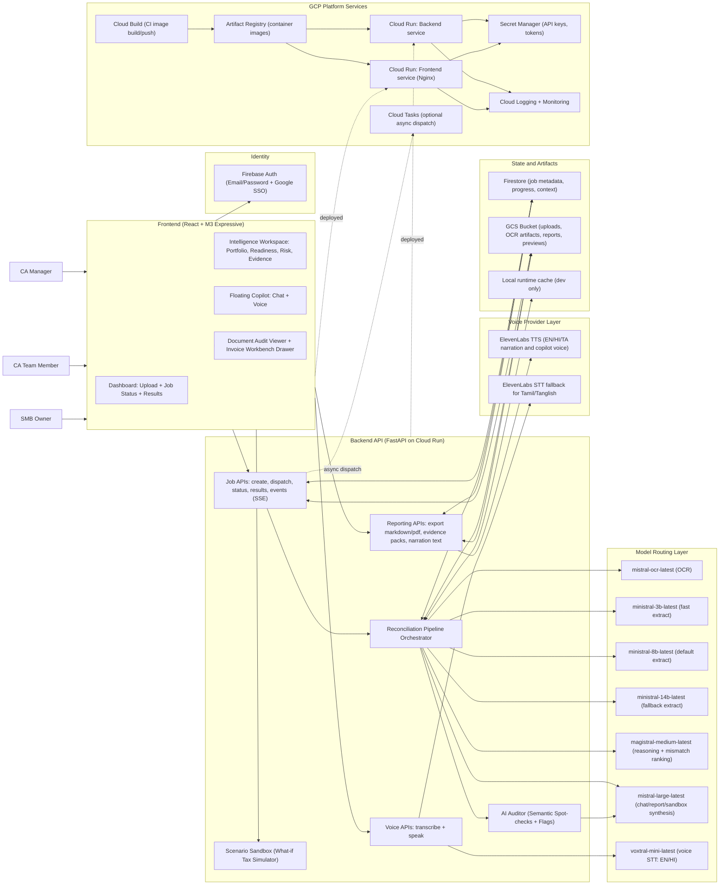
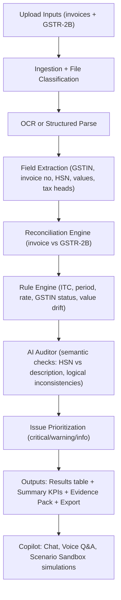

# GST Intelligence Magic - Figma MCP System Architecture

This document gives you a complete architecture diagram spec for:
- Frontend + backend
- Mistral model routing
- ElevenLabs voice layer
- GCP deployment/services
- End-to-end product flows

You can:
1. Render Mermaid directly for docs/reviews.
2. Paste the "Figma MCP prompt" section into your Figma MCP workflow to generate a FigJam/diagram frame.

## 1) Full System Architecture (Mermaid)



## 2) Processing Pipeline (Mermaid)



## 3) Figma MCP Prompt (Paste into your Figma MCP workflow)

Use this prompt in your Figma MCP tool to generate a clean architecture frame:

```text
Create a landscape system architecture diagram frame titled "GST Intelligence Magic - End-to-End Architecture".

Style:
- Material 3 expressive, professional fintech look.
- Use compact cards, rounded corners 16-24, subtle glass highlights only on hero and data planes.
- Keep high readability for both light and dark themes.
- Use color groups:
  - Frontend/UI: blue
  - Backend/API: indigo
  - Model routing: purple
  - Voice provider: teal
  - GCP infra: green
  - Data stores: amber

Layout:
1) Top row: Users -> Frontend -> Backend API.
2) Middle row: Model routing lane (Mistral OCR, Ministral 3b/8b/14b, Magistral, Mistral Large, Voxtral).
3) Side lane: ElevenLabs TTS/STT fallback.
4) Lower row: Data layer (Firestore, GCS, runtime cache).
5) Bottom row: GCP infra (Cloud Run FE/BE, Cloud Tasks optional, Artifact Registry, Cloud Build, Secret Manager, Logging/Monitoring).
6) Add directional connectors with labels for key flows:
   - upload
   - reconcile
   - ai auditor
   - scenario sandbox
   - narration
   - report export
   - async dispatch

Mandatory components:
- Frontend modules: Dashboard, Intelligence Workspace, Floating Copilot, Document Audit Viewer.
- Backend modules: Job APIs, Pipeline Orchestrator, Scenario Sandbox, AI Auditor, Reporting, Voice APIs.
- Include "All Jobs vs Selected Job scope" badge near Intelligence Workspace.
- Include language support note: EN, HI, TA, Hinglish, Tanglish.
- Include deployment note: "Cloud Run primary, Cloud Tasks optional".

Output:
- One polished architecture frame.
- One simplified flow frame (upload -> reconcile -> ai auditor -> outputs -> copilot).
- Components should be named exactly as above for handoff consistency.
```

## 4) Coverage Checklist

This diagram covers:
- Frontend pages/components
- Backend services and APIs
- Model stack and model-to-task mapping
- Voice stack (Mistral + ElevenLabs)
- GCP services and deployment lifecycle
- Primary business flows (upload, reconcile, audit, report, chat, voice, scenario simulation)
